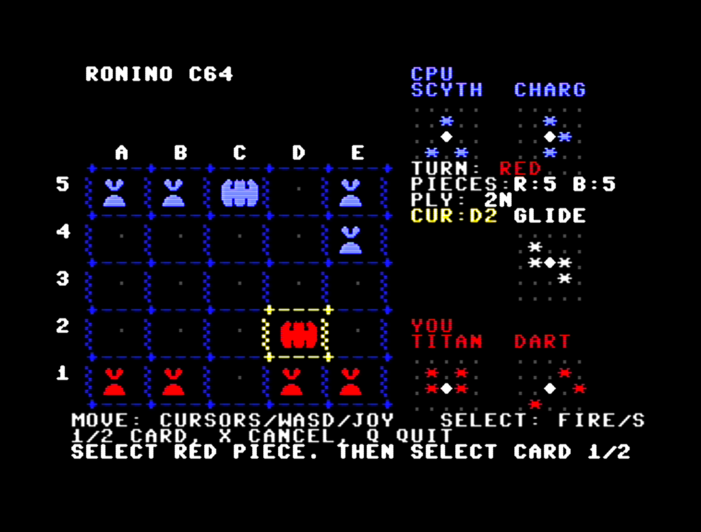

# RONINO

## How it works

Pieces are charset characters. The C64 has 8 hardware sprites. A board with 10 pieces plus a cursor needs multiplexing, which causes flicker. Custom charset glyphs (2x2 for pawns, 3x2 for kings) avoid the problem entirely - stable on every frame.

The AI doesn't freeze the screen. Negamax with alpha-beta pruning at depth 3. Root moves are searched one per frame, and inside the tree searchHeartbeat yields to the VIC every 24 nodes. The status line updates live.

Direct video memory access. Screen RAM at $0400 and color RAM at $D800 are written directly. A table keeps the conversion fast.

Fan-made, not affiliated with original game authors or publishers. Code license: BSD-3-Clause.
